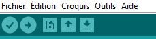

# FootSwitchPedalGinzu

 
 
 
 
 
 
### introduction
***

Hi people !

just a simple code i have written to simulate left and right key of the keyboard.

Beyond this, the idea is to set one pedal with the Left keyboard key and the Right pedal to the Right keyboard key.
 
 
 
 
 
 
### What's the point ?
***

This is useful if you want to be able to make pedals for arcade lightgun games.

 
 
 
 
 
 
### How ?
***

use pin2 and pin3 of the arduino to use each pedal:

- pin2 = Left pedal
- pin3 = Right pedal

Here is the arduino compatible with the firmware :

Pro Micro ATmega32U4 Module de Développement 5V 16MHz Micro USB pour Arduino IDE Bootloader

 
 
 
 
 
 
### How to use it ? 
***

*Step 1 :*

Download the arduino ide : 

https://www.arduino.cc/en/software   (select the software according to your Operating system)

*Step 2 :*

plug in your arduino pro micro on your computer using a usb to micro usb outlet. (male/male)

*Step 3 :*

You should actually install SparkFun's boards package.

(In the Arduino IDE ) : 

Go to file -> preferences and add the following in additional boards manager urls: https://raw.githubusercontent.com/sparkfun/Arduino_Boards/master/IDE_Board_Manager/package_sparkfun_index.json

Next go to tools -> board -> boards manager and find SparkFun AVR boards and install it. After that you will have entries in the boards menu for the SparkFun boards. Select the ProMicro and next you can select the speed version matching your board.

 
 
 
 
 
 

You should also be sure you have the correct serial port selected under tools/ports. (select the right one)

*Step 4 :* 

Open the ino file (File/open ...) and select my ino code : FootSwitchCode.ino

*Step 5 :*

Now, just compile it (button at the top with a check logo)

And  when it's done, upload the firmware into the arduino (button with the arrow just near the check logo button).

At this point, the arduino should start to light up leds.

*Step 6 :*

for the wiring, each button must be connected on one side to one of the pins, on the other to the common ground (gnd of the arduino).
 
 
 
 
 
 

**Have fun!**

 
 
 
 
 
 
 